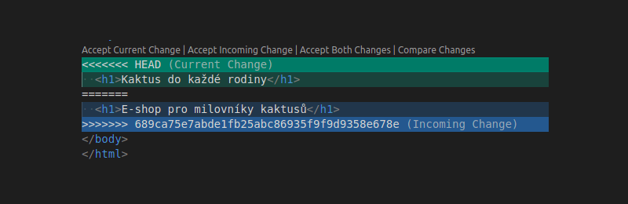

# Spolupráce na jedné větvi

Verzovací systém Git nabízí několik možnosti pro organizaci spolupráce mnoha lidí na jednom projektu. My v této lekci pro začátek vybereme ten nejjednodušší případ, kdy na jednom projektu pracují pouze dva lidé. Taková spolupráce nevyžaduje použití složitějších možností Gitu, jako je práce s větvemi, a vystačíme si pouze s jedním novým příkazem.

## Vzdálený a lokální repozitář

Když na projektu pracuje pouze jeden vývojář, situace je téměř vždy stejná. Projekt má jeden vzdálený repozitář například na GitHubu a vývojář ho má naklonovaný v lokální kopii. Pokud pracují na projektu vývojáři dva, každý má naklonovanou svou lokálni kopii a z té může pomocí příkazu `git push` odeslat svoje commity do společného vzdáleného repozitáře. Druhý vývojář si pak tyto nové změny může stáhnout do svého lokálního repozitáře pomocí příkazu `git pull`.

Během používáním příkazu `git pull` mohou nastat různé situace, které je potřeba umět vlastními silami vyřešit. V podstatě se potkáme se čtyřmi základními scénáři, které postupně detailně rozebereme:

- **scénář 1**: vzájemné koordinované střídání `push` a `pull`,
- **scénář 2**: automatický `merge` během `pull`,
- **scénář 3**: konflikt během `pull` a manuální `merge`,
- **scénář 4**: zablokovaný `pull` kvůli lokálním změnám.

Abychom si vyzkoušeli spolupráci na jedné větvi na praktickém příkladu, budeme po zbytek lekce sledovat dva vývojáře **Aleše** a **Bedřicha**, jak společně vyvíjejí webovou stránku pro milovníky kaktusů jménem _Pichláci_. Projekt bude pro naše účely extrémně jednoduchý. Určitě se nám však bude hodit tento [obrázek kaktusu](assets/cactus.jpg).

Nejprve musí jeden z vývojářů, například Aleš, založit projekt na svém GitHubu jménem `pichlaci`. Do tohoto projektu pak musí pozvat Bedřicha jeko spolupracovníka. To se provede na stránce _Settings_ → _Collaborators_.

Poté si oba, Aleš i Bedřich, naklonují tento společný repozitář k sobě do počítače.

## Scénář 1: Push a pull

Aleš nyní na svém počítači vytvoří základní strukturu projektu

Vytvoří základní soubory _index.html_ a _style.css_.

Takto založený projekt může rovnou **commitnout**.

Potom provede příkazy:

```
$ git push
$ git pull
```

## Scénář 2: Automatický merge

Všechno se povedlo, nemusíme nic řešit.

## Scénář 3: Řešení konfliktů

Konflikt nastává ve chvíli, kdy se příkazu `git pull` nepovedlo automaticky zmergovat lokální a příchozí změny. V takovém případě je potřeba lidský zásah, aby Gitu řekl, jak má výsledek merge vypadat.

### Anatomie konfliktu



## Scénář 4: Lokální změny

Pokud máme v repozitáři lokální změny, může se stát, že by provedení `git pull` tyto změny přepsalo příchozími změnami. V takovém případě Git provedení `pull` nedovolí.

### Commitnutí změn

Běžnou cestou pomocí `git commit` a následný `git pull`.

### Smazání změn

**POZOR!!**, zde může dojít k nevratnému smazání vaší práce.

```
$ git reset --hard
```
